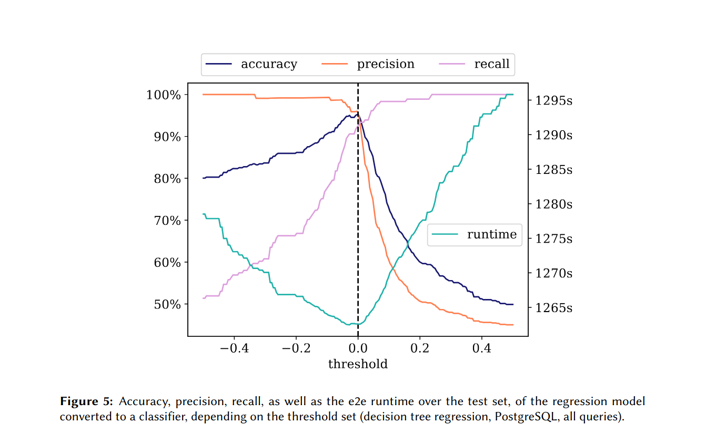

# Publications

TODO

## 2026

    

        
    

    

        <h3 class="publication-title">
               Selective Use of Yannakakis’ Algorithm for Consistent Performance Gains
            </a>
        </h3>
        
Accepted for 28th International Workshop on Design, Optimization, Languages and Analytical Processing of Big Data (DOLAP 26)

        
Daniela Böhm, Georg Gottlob, Matthias Lanzinger, Davide Mario Longo, Cem Okulmus, Reinhard Pichler, Alexander Selzer 

        
2026

        

            Query optimisation, data management
            <a href="https://arxiv.org/pdf/2502.20233" class="tag tag-arxiv">ARXIV</a>
            <a href="https://github.com/dbai-tuw/yannakakis-rewriting" class="tag tag-github">GITHUB</a>
        

    

