# Publications

## 2026

    

        
    

    

        <h3 class="publication-title">
               Selective Use of Yannakakis’ Algorithm for Consistent Performance Gains (accepted)
        </h3>
        
<strong>To be published in</strong> 28th International Workshop on Design, Optimization, Languages and Analytical Processing of Big Data (DOLAP 26)

        
Daniela Böhm, Georg Gottlob, Matthias Lanzinger, Davide Mario Longo, Cem Okulmus, Reinhard Pichler, Alexander Selzer

        
2026

        

            Query optimisation, data management
            <a href="https://doi.org/10.48550/arXiv.2502.20233" class="tag tag-arxiv">arXiv</a>
            <a href="https://github.com/dbai-tuw/yannakakis-rewriting" class="tag tag-github">GitHub</a>
        

    

## 2025

    

        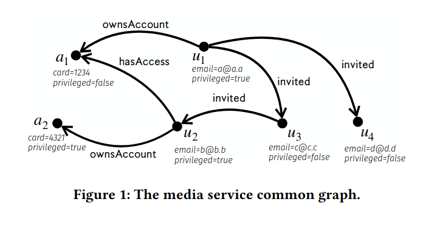
    

    

        <h3 class="publication-title">
 <a href="https://doi.org/10.48550/arXiv.2502.01295" class="publication-link">
               Common Foundations for SHACL, ShEx, and PG-Schema
  </a>
        </h3>
        
Proceedings of the ACM on Web Conference 2025 (WWW '25)

        
Shqiponja Ahmetaj, Iovka Boneva, Jan Hidders, Katja Hose, Maxime Jakubowski, José Emilio Labra Gayo, Wim Martens, Fabio Mogavero, Filip Murlak, Cem Okulmus, Axel Polleres, Ognjen Savković, Mantas Šimkus, Dominik Tomaszuk

        
2025

        

            SHACL, ShEx, PG-Schema, Graph Schemas
	<a href="https://doi.org/10.48550/arXiv.2502.01295" class="tag tag-arxiv">arXiv</a>
        

    

    

        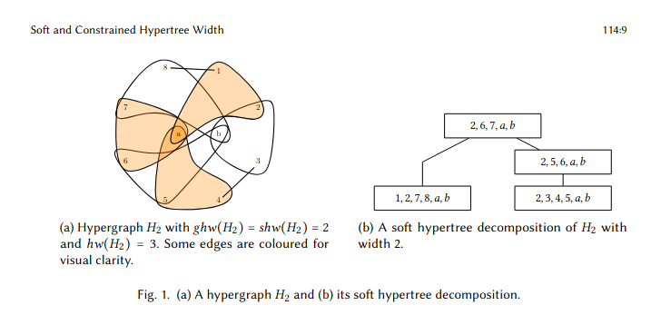
    

    

        <h3 class="publication-title">
<a href="https://doi.org/10.1145/3725251" class="publication-link">
               Soft and Constrained Hypertree Width
        </a> 
</h3>
        
Symposium on Principles of Database Systems (PODS 25) 

        
Matthias Lanzinger, Cem Okulmus, Reinhard Pichler, Alexander Selzer, Georg Gottlob

        
2025

        

            Hypertree width, Query optimization
	<a href="https://doi.org/10.48550/arXiv.2412.11669" class="tag tag-arxiv">arXiv</a>
        

    

    

        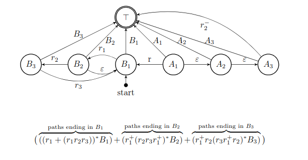
    

    

        <h3 class="publication-title">
<a href="https://doi.org/10.1007/978-3-031-94575-5_19" class="publication-link">
               Towards Practicable Algorithms for Rewriting Graph Queries Beyond DL-Lite
</a>
        </h3>
        
European Semantic Web Conference (ESWC 2025)

        
Bianca Löhnert, Nikolaus Augsten, Cem Okulmus, Magdalena Ortiz

        
2025

        

            Graph queries, Query rewriting
	<a href="https://doi.org/10.48550/arXiv.2405.18181" class="tag tag-arxiv">arXiv</a>
        

    

    

        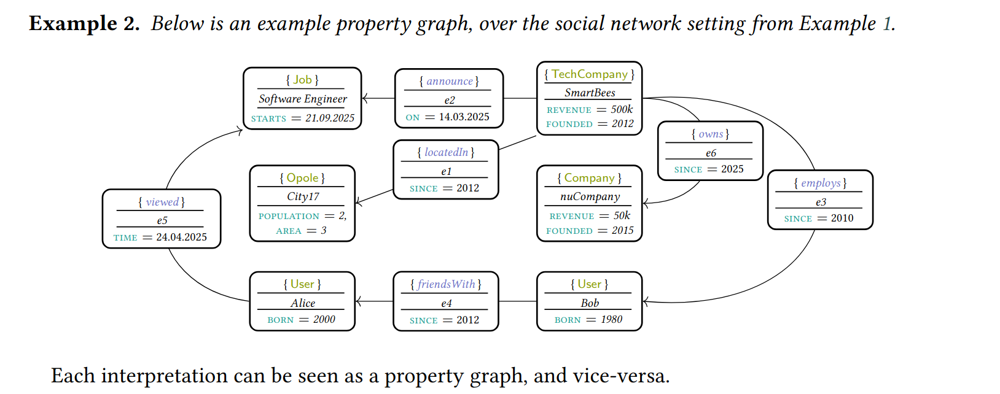
    

    

        <h3 class="publication-title">
<a href="https://ceur-ws.org/Vol-4091/paper40.pdf" class="publication-link">
               Query Rewriting for Nested Navigational Queries over Property Graphs
</a>
        </h3>
        
38th International Workshop on Description Logics (DL 2025)

        
Bianca Löhnert, Nikolaus Augsten, Cem Okulmus, Magdalena Ortiz

        
2025

        

            Property graphs, Description logics
        

    

## 2024

    

        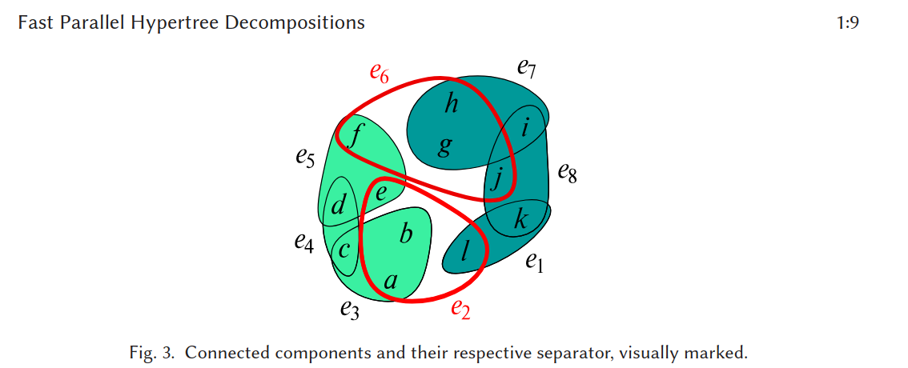
    

    

        <h3 class="publication-title">
<a href="https://doi.org/10.1145/3638758" class="publication-link"> Fast Parallel Hypertree Decompositions in Logarithmic Recursion Depth (Journal article) </a>
        </h3>
        
ACM Transactions on Database Systems (TODS)

        
Georg Gottlob, Matthias Lanzinger, Cem Okulmus, Reinhard Pichler

        
2024

        

            Hypertree decompositions, Parallel algorithms
        

    

    

        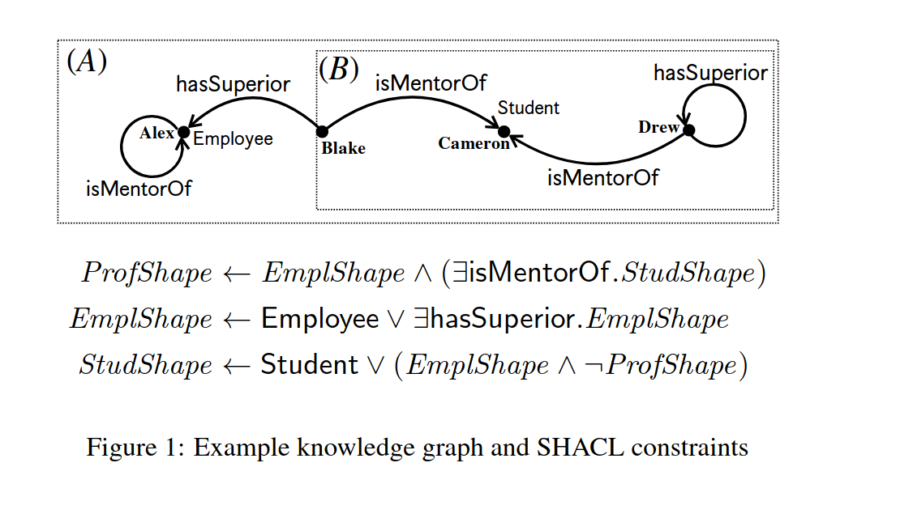
    

    

        <h3 class="publication-title">
<a href="https://doi.org/10.24963/kr.2024/52" class="publication-link">
               SHACL Validation under the Well-founded Semantics 
</a>
        </h3>
        
International Conference on Principles of Knowledge Representation and Reasoning (KR 2024)

        
Cem Okulmus, Mantas Šimkus

        
2024

        

            SHACL, Well-founded semantics
        

    

    

        
    

    

        <h3 class="publication-title">
<a href="https://ceur-ws.org/Vol-3739/abstract-17.pdf" class="publication-link">
               Towards Practicable Algorithms for Rewriting Graph Queries Beyond DL-Lite (Extended Abstract) </a>
        </h3>
        
37th International Workshop on Description Logics (DL 2024)

        
Bianca Löhnert, Nikolaus Augsten, Cem Okulmus, Magdalena Ortiz

        
2024

        

            Graph queries, Query rewriting
        

    

    

        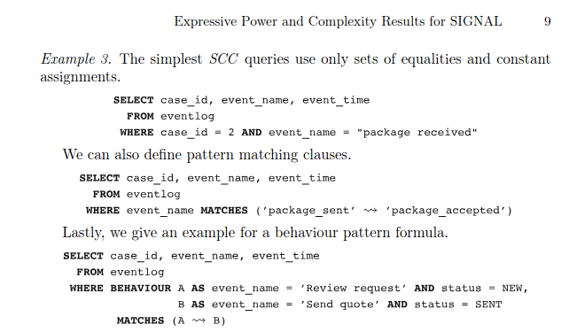
    

    

        <h3 class="publication-title">
<a href="https://doi.org/10.1007/978-3-031-70418-5_1" class="publication-link">
               Expressive Power and Complexity Results for SIGNAL, an Industry-scale Process Query Language
</a>
        </h3>
        
International Conference on Business Process Management (BPM 2024) - Forum paper

        
Timotheus Kampik, Cem Okulmus

        
2024

        

            Process query language, Complexity 
	<a href="https://arxiv.org/abs/2310.14939" class="tag tag-arxiv">arXiv</a>
        

    

    

        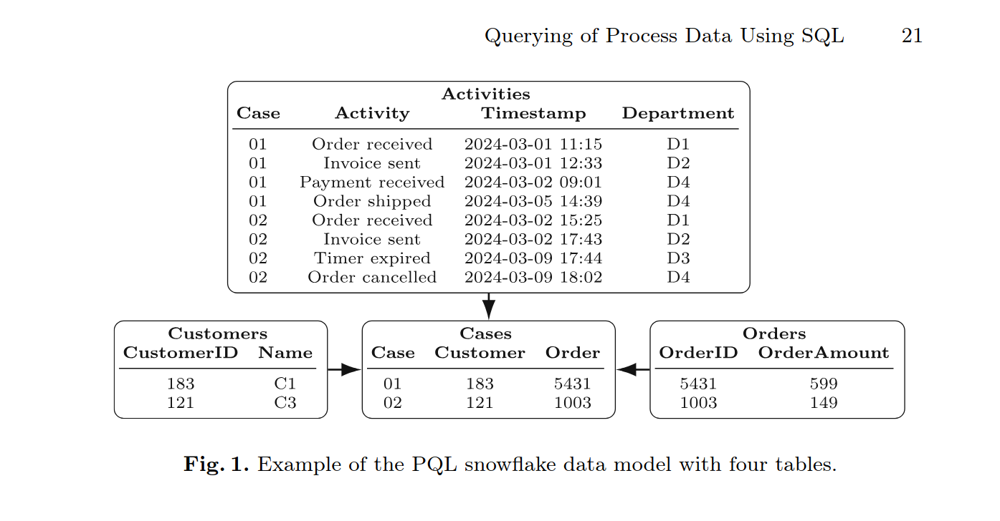
    

    

        <h3 class="publication-title">
<a href="https://doi.org/10.1007/978-3-031-82225-4_2" class="publication-link">
               One Language to Rule Them All: Behavioural Querying of Process Data Using SQL </a>
        </h3>
        
International Conference on Process Mining (ICPM 2024)

        
Jakob Brand, Timotheus Kampik, Cem Okulmus, Matthias Weidlich

        
2024

        

            SQL, Process mining
        

    

## 2023

    

        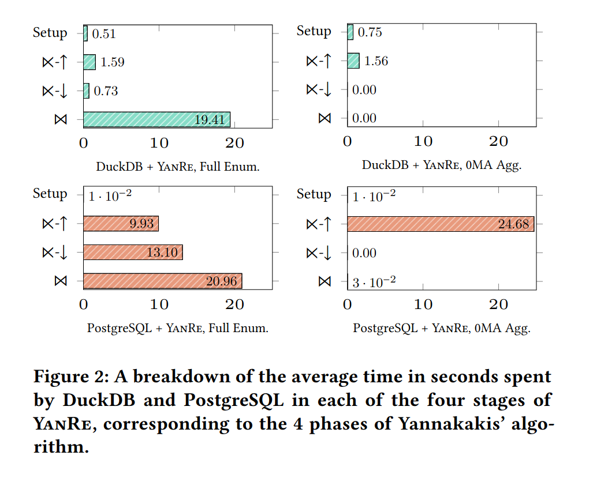
    

    

        <h3 class="publication-title">
<a href="https://arxiv.org/abs/2303.02723" class="publication-link">
               Structure-Guided Query Evaluation: Towards Bridging the Gap from Theory to Practice.</a>
        </h3>
        
Preprint

        
Georg Gottlob, Matthias Lanzinger, Davide Mario Longo, Cem Okulmus, Reinhard Pichler, Alexander Selzer

        
2023

        

            Query evaluation, Structural decomposition
        

    

    

        
    

    

        <h3 class="publication-title">
<a href="https://dl.acm.org/doi/10.1145/3578266" class="publication-link">
               Incremental Updates of Generalized Hypertree Decompositions
</a>
        </h3>
        
ACM Journal of Experimental Algorithmics (JEA)

        
Georg Gottlob, Matthias Lanzinger, Davide Mario Longo, Cem Okulmus

        
2023

        

            Generalized hypertree decompositions, Incremental algorithms
	<a href="https://doi.org/10.48550/arXiv.2209.10375" class="tag tag-arxiv">arXiv</a>
        

    

    

        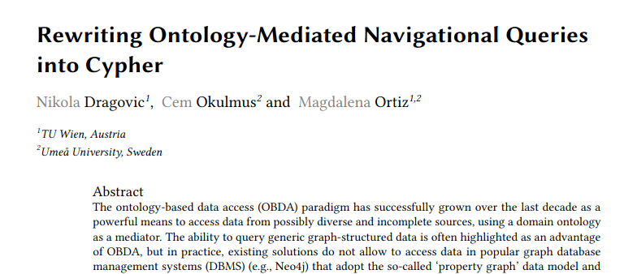
    

    

        <h3 class="publication-title">
<a href="https://ceur-ws.org/Vol-3515/paper-9.pdf" class="publication-link">
               Rewriting Ontology-Mediated Navigational Queries into Cypher </a>
        </h3>
        
36th International Workshop on Description Logics (DL 2023)

        
Nikola Dragovic, Cem Okulmus, Magdalena Ortiz

        
2023

        

            Ontology-mediated queries, Cypher
        

    

    

        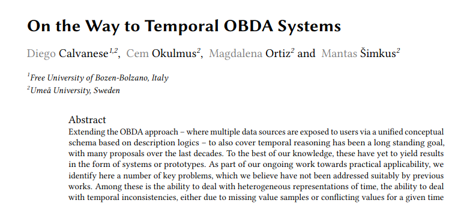
    

    

        <h3 class="publication-title">
<a href="https://ceur-ws.org/Vol-3409/paper4.pdf" class="publication-link">
               On the Way to Temporal OBDA Systems (short paper)
</a>
        </h3>
        
15th Alberto Mendelzon International Workshop on Foundations of Data Management (AMW 2023)

        
Diego Calvanese, Cem Okulmus, Magdalena Ortiz, Mantas Šimkus

        
2023

        

            Temporal OBDA, Logic
        

    

    

        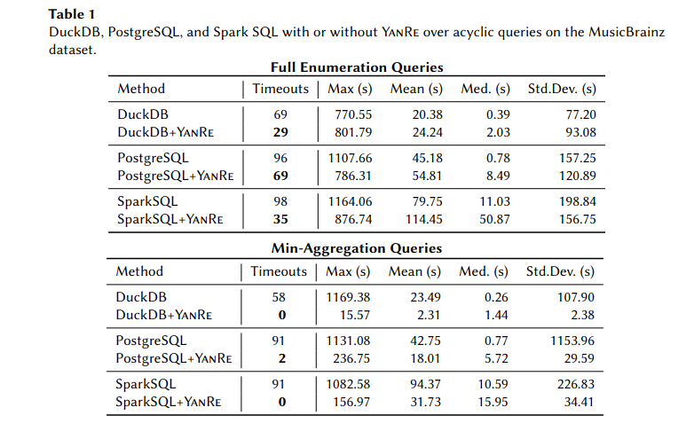
    

    

        <h3 class="publication-title">
<a href="https://ceur-ws.org/Vol-3409/paper6.pdf" class="publication-link">
              Reaching Back to Move Forward: Using Old Ideas to Achieve a New Level of Query Optimization (short paper)
</a>
        </h3>
        
15th Alberto Mendelzon International Workshop on Foundations of Data Management (AMW 2023)

        
Georg Gottlob, Matthias Lanzinger, Davide Mario Longo, Cem Okulmus, Reinhard Pichler, Alexander Selzer

        
2023

        

            Query optimisation
        

    

## 2022

    

        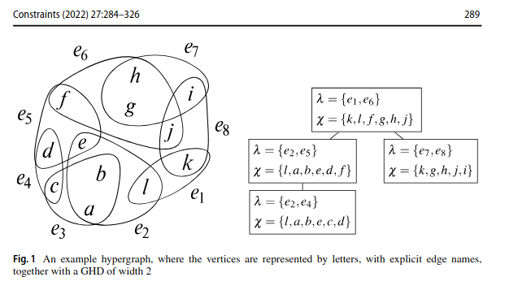
    

    

        <h3 class="publication-title">
<a href="https://doi.org/10.1007/s10601-022-09332-1" class="publication-link">
               Fast and parallel decomposition of constraint satisfaction problems (Journal article)
</a>
        </h3>
        
Constraints - An International Journal

        
Georg Gottlob, Cem Okulmus, Reinhard Pichler

        
2022

        

            Constraint satisfaction, Parallel decomposition
        

    

    

        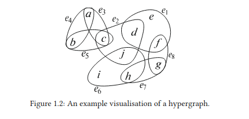
    

    

        <h3 class="publication-title">
<a href="https://doi.org/10.34726/hss.2023.108704" class="publication-link">
               Parallel Computation of Structural Decompositions
</a>
        </h3>
        
PhD Thesis, Technische Universität Wien

        
Cem Okulmus

        
2022

        

            Structural decompositions, Thesis
        

    

    

        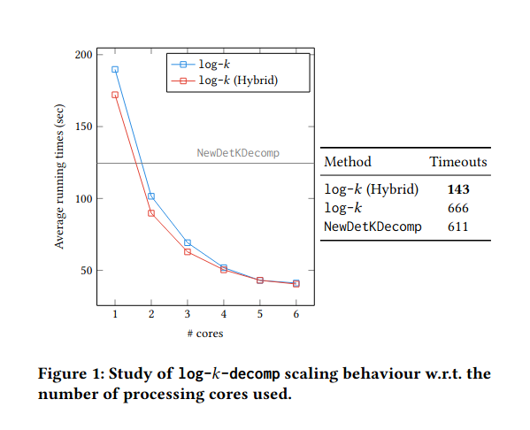
    

    

        <h3 class="publication-title">
<a href="https://doi.org/10.1145/3517804.3524153" class="publication-link">
               Fast Parallel Hypertree Decompositions in Logarithmic Recursion Depth.
</a>
        </h3>
        
41st ACM SIGMOD-SIGACT-SIGAI Symposium on Principles of Database Systems (PODS 22)

        
Georg Gottlob, Matthias Lanzinger, Cem Okulmus, Reinhard Pichler

        
2022

        

            Hypertree decompositions, Parallel algorithms
	<a href="https://arxiv.org/abs/2104.13793" class="tag tag-arxiv">arXiv</a>
        

    

## 2020

    

        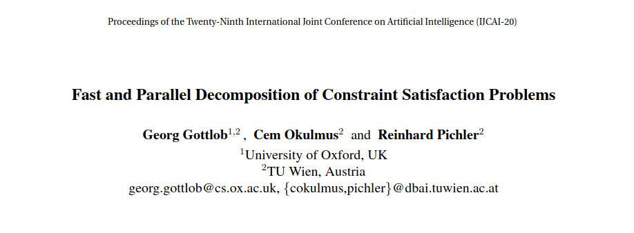
    

    

        <h3 class="publication-title">
<a href="https://doi.org/10.24963/ijcai.2020/161" class="publication-link">
               Fast and Parallel Decomposition of Constraint Satisfaction Problems.
</a>
        </h3>
        
 Twenty-Ninth International Joint Conference on Artificial Intelligence (IJCAI-20)

        
Georg Gottlob, Cem Okulmus, Reinhard Pichler

        
2020

        

            Constraint satisfaction, Parallel decomposition
        

    

    

        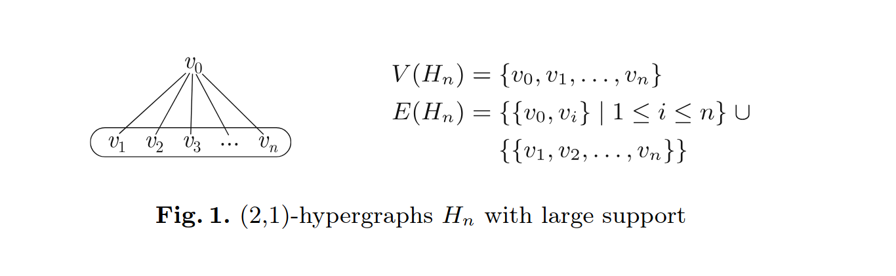
    

    

        <h3 class="publication-title">
<a href="https://doi.org/10.1007/978-3-030-58942-4_1" class="publication-link">
               The Hypertrac Project: Recent progress and future research directions on hypergraph decompositions
</a>
        </h3>
        
Integration of Constraint Programming, Artificial Intelligence, and Operations Research - 17th International Conference (CPAIOR 2020)

        
Georg Gottlob, Matthias Lanzinger, Davide Mario Longo, Cem Okulmus, Reinhard Pichler

        
2020

        

            Hypergraph decompositions, Hypertrac
<a href="https://arxiv.org/abs/2012.14762" class="tag tag-arxiv">arXiv</a>
        

    

## 2019

    

        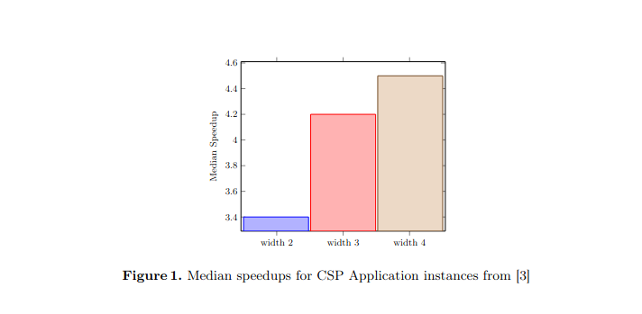
    

    

        <h3 class="publication-title">
<a href="https://ceur-ws.org/Vol-2369/short03.pdf" class="publication-link">
               Parallel Computation of Generalized Hypertree Decompositions (short paper)e
</a>
        </h3>
        
Alberto Mendelzon International Workshop on Foundations of Data Management (AMW 2019)

        
Georg Gottlob, Cem Okulmus, Reinhard Pichler

        
2019

        

            Generalized hypertree decompositions, Parallel computation
        

    

